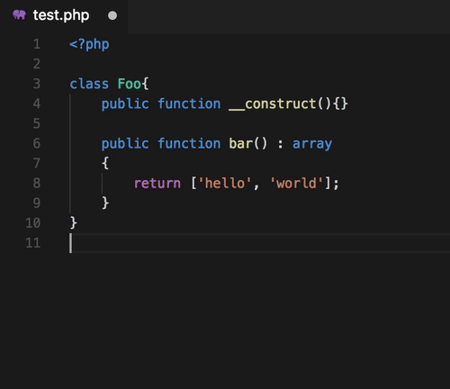

# vscode-php-cs-fixer

This extension adds support for running `php-cs-fixer fix` on PHP files in Visual Studio Code.



## Install

If not already installed, download [php-cs-fixer](https://github.com/FriendsOfPHP/PHP-CS-Fixer) and move it to a directory in your `PATH`. For example:
```bash
$ curl -L http://cs.sensiolabs.org/download/php-cs-fixer-v2.phar -o php-cs-fixer
$ chmod +x php-cs-fixer
$ mv php-cs-fixer /usr/local/bin/
```

If you don't want `php-cs-fixer` in your `PATH`, set the `vscode-php-cs-fixer.toolPath` setting to the path of `php-cs-fixer`.

## Extension Settings

This extension contributes the following settings:

* `vscode-php-cs-fixer.toolPath`: The path to the php-cs-fixer tool (default: "php-cs-fixer")
* `vscode-php-cs-fixer.useCache`: Use a cache file when fixing files (--using-cache) (default: false)
* `vscode-php-cs-fixer.rules`: Rules to use when fixing files (--rules) (default: "@PSR1,@PSR2,@Symfony,-yoda_style")
* `vscode-php-cs-fixer.fixOnSave`: Runs fix command on save (default: true)
